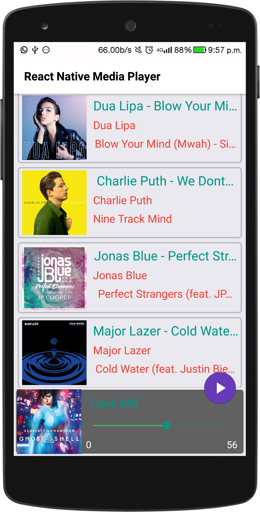
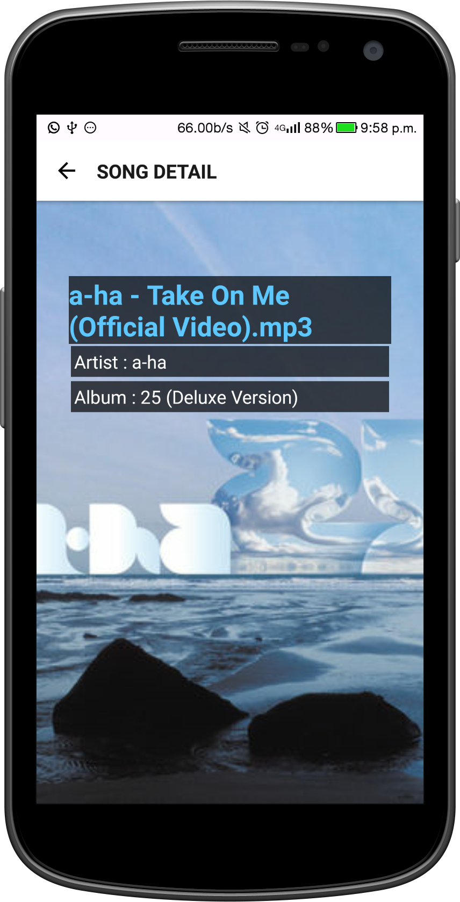

# React-Native-Music-Player 

Beautiful Music Player built with React Native - Android

## This Projects Features

- Using [React Navigation](https://reactnavigation.org/docs/intro/)  for screen transition.
- Using [React Navigation](https://reactnavigation.org/docs/intro/)  to pass arguments and display list and Detail.
- Use of custom ReactNative Module to featch all Songs from SD card.
- Diaplay all Fetched Songs on a ReactNative List View.
- Tap on list item to start playback.
- Tap on AlbumArt to view song's detail.
- Slider Seekbar to seek to a duration.
- Use of ReactNative Events Callback to update Slider progress.

 

### Legal

     Copyright 2017 Hitesh Sahu (http://hiteshsahu.com)

       Licensed under the Apache License, Version 2.0 (the "License");
       you may not use this file except in compliance with the License.
       You may obtain a copy of the License at

           http://www.apache.org/licenses/LICENSE-2.0

       Unless required by applicable law or agreed to in writing, software
       distributed under the License is distributed on an "AS IS" BASIS,
       WITHOUT WARRANTIES OR CONDITIONS OF ANY KIND, either express or implied.
       See the License for the specific language governing permissions and
       limitations under the License.
